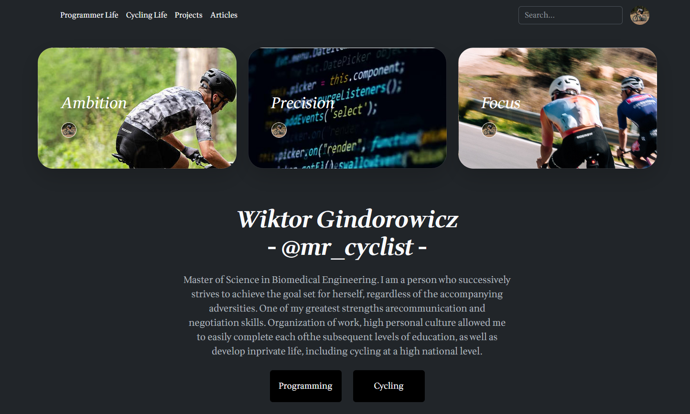
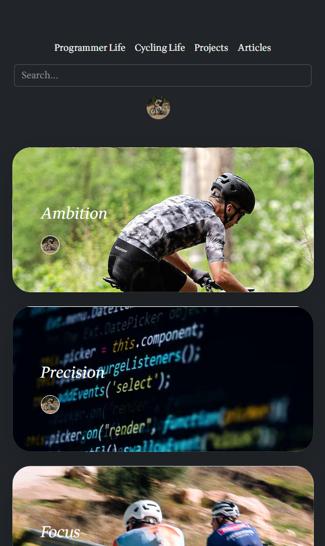
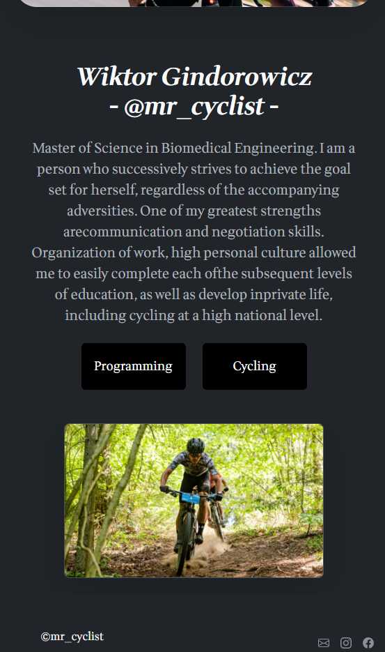

# Personal Site - Project Bootstrap

# Project Name
- A perfect project for juniors who are starting to build confidence with Bootstrap.

## Table of Contents
* [General Info](#general-information)
* [Technologies Used](#technologies-used)
* [Features](#features)
* [Screenshots](#screenshots)
* [Acknowledgements](#acknowledgements)
* [Contact](#contact)

## General Information
- This is my first solution of Boostrap. An excellent exercise in combining HTML, CSS and its add-ons like Bootstrap Not forgetting about responsiveness.

## Technologies Used
- HTML5 Markup
- CSS 
- Flexbox
- Grid
- Bootstrap
- RWD - Responsive Web Design 

## Features
List the ready features here:
- Bootstrap

## Screenshots

## Acknowledgements
- This project was based on default perosnal websites using Bootstrap.

## Contact
Created by [@mr_cyclist] - contact me!
